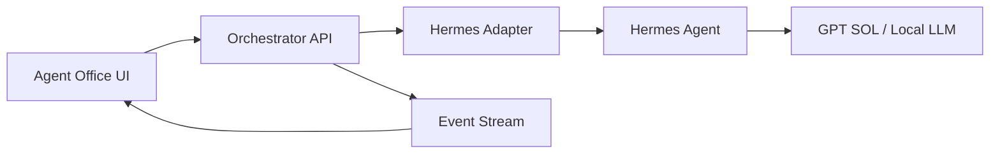

# Agent Office

AI 서브에이전트 팀을 게임 속 사무실처럼 운영하는 인터랙티브 관제 UI입니다. 기획자, 판단 PM, 디자이너, 개발자, QA, 리서처가 각자 맡은 일을 수행하고, 사용자는 캐릭터를 눌러 현재 작업을 확인하거나 추가 지시를 내릴 수 있습니다.

현재 저장소는 **공개 GitHub 프로젝트별 실제 작업 접수·상태 추적 MVP**와 browser-local 오피스 미리보기를 함께 제공합니다. 사용자는 `aski-p`의 공개 저장소를 선택하고 미션을 GitHub 이슈로 확정합니다. 이슈는 Planner → Builder → QA Hermes worker의 durable queue이며, worker는 저장소별 격리 branch/worktree에서 수정·테스트 후 PR까지만 생성합니다.

> 사무실 캐릭터 이동·퍼센트·Run/Pause/Stop은 `PREVIEW OFFICE` 시각화이며 실제 runner heartbeat가 아닙니다. 실제 상태의 권위 기준은 선택 프로젝트의 `[Agent Office]` GitHub 이슈 label과 PR입니다. 현재 웹 intake는 공개 저장소만 지원하고, private repository는 GitHub App 설치·installation-scoped token이 구현되기 전까지 지원하지 않습니다.

## 구현된 경험

- `aski-p` 공개 GitHub 저장소 실제 조회와 프로젝트 선택
- 프로젝트별 `[Agent Office]` 이슈 작성 계약과 durable 상태 label 조회
- 선택 프로젝트의 공개 PR 조회
- Planner → Builder → QA 외부 Hermes worker 계약과 PR-only 승인 경계
- 책상과 역할별 업무 구역이 있는 고해상도 셀 셰이딩 오피스 6종
- 인간·동물·오리지널 카툰 판타지·로봇 캐릭터 100종
- 확대해도 깨지지 않는 SVG 캐릭터와 25가지 카테고리별 고유 실루엣
- 메인/보조 색상, 액세서리 19종, 표정, 크기 커스터마이징
- 캐릭터를 길게 눌러 집은 뒤 원하는 위치에 놓는 직접 배치
- 실행 중인 직원 이동, 상태 말풍선, 진행률 시뮬레이션
- 직원 목록과 사무실 캐릭터 선택 동기화
- 현재 작업, 진행률, 다음 작업, 공개 활동 로그
- 추가 지시 및 우선순위 변경
- 프로젝트 실행, 일시정지, 재개, 중지
- 새 미션을 역할별 작업으로 분배
- 직원 고용, 모델 선택, 해고 확인 흐름
- Plan → Design / Build → QA → Judgment 파이프라인
- 데스크톱, 태블릿, iPhone 반응형 레이아웃
- 키보드 포커스와 모션 감소 설정
- 선택 캐릭터, 커스터마이징, 고용/해고, 위치, 오피스 스킨 로컬 저장

## 로컬 실행

Node.js 22.13 이상이 필요합니다.

```bash
npm install
npm run dev
```

프로덕션 검증:

```bash
npm run lint
npm run build
```

## 주요 파일

- `app/page.tsx` — GitHub 프로젝트 선택·미션 접수 UI와 오피스 미리보기
- `app/api/projects/` — 공개 프로젝트와 Agent Office 이슈 상태 read API
- `app/api/repo/pulls/route.ts` — 선택 프로젝트 공개 PR read API
- `lib/github-projects.ts` — 저장소 identity 검증, queue URL, 상태 계약
- `docs/AGENT_WORKER_CONTRACT.md` — Planner/Builder/QA 격리·권한·상태 전이 계약
- `app/character-data.ts` — 100종 캐릭터 도감과 6종 오피스 스킨 데이터
- `app/globals.css` — 반응형 레이아웃, 캐릭터, 셀 셰이딩 비주얼
- `app/components/toon-agent.tsx` — 100종 셀 셰이딩 SVG 캐릭터 렌더러
- `public/office-bg.webp`, `public/office-skins/` — 경량화된 카툰 오피스 배경
- `docs/PRODUCT_SPEC.md` — 제품/UX/워크플로우 기획서
- `docs/HERMES_SOL_HANDOFF.md` — Hermes + GPT SOL 구현 지시서와 연동 계약

## 실제 연동 방향

프런트엔드가 Hermes를 직접 호출하지 않도록 합니다.



화면에는 모델의 숨은 추론을 노출하지 않습니다. 공개 요약, 작업 상태, 도구 실행 결과, 변경 파일, 테스트 결과만 이벤트로 전달합니다.

## 제품 원칙

- 진행률은 LLM의 주관적 퍼센트가 아니라 완료된 체크리스트 가중치로 계산합니다.
- 추가 지시는 현재 작업을 조용히 덮어쓰지 않고 revision 이벤트로 남깁니다.
- 일시정지는 안전 체크포인트에서 멈추며, 중지는 기존 결과물과 로그를 보존합니다.
- 배포, 병합, secret 접근, 외부 메시지, 파괴적 작업은 사용자 승인을 요구합니다.
- 캐릭터 이동은 분위기 연출이며 모든 핵심 기능은 DOM 기반 목록과 패널에서도 사용할 수 있습니다.

## 다음 구현 단계

1. GitHub App 설치 기반 private repository 지원과 installation-scoped token
2. 서버 저장소에 issue/PR event audit와 worker heartbeat 집계
3. 실제 GitHub 상태 기반 Run/Pause/Stop 및 instruction revision
4. project membership, approval, artifact UI
5. webhook 또는 durable queue로 polling latency 개선

구체적인 상태 머신, 데이터 모델, API, 이벤트 타입, 수용 기준은 `docs/`를 참고하세요.
