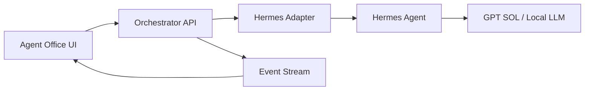

# Agent Office

AI 서브에이전트 팀을 게임 속 사무실처럼 운영하는 인터랙티브 관제 UI입니다. 기획자, 판단 PM, 디자이너, 개발자, QA, 리서처가 각자 맡은 일을 수행하고, 사용자는 캐릭터를 눌러 현재 작업을 확인하거나 추가 지시를 내릴 수 있습니다.

현재 저장소는 **브라우저에서 실제로 동작하고 복원되는 local-first 워크플로 MVP**와 Hermes + GPT SOL 연동 계약을 포함합니다. 미션 상태 머신, 체크포인트, 실행·일시정지·재개·중지, 지시, 고용·업무 이관·종료, 알림, 설정은 브라우저에 영속 저장됩니다.

> 현재 실행 모드는 `browser-local`입니다. 실제 Hermes child job 실행, 서버 DB, 다중 기기 동기화, SSE/WebSocket은 아직 연결되지 않았으며 화면에서 연결된 것처럼 표시하지 않습니다.

## 구현된 경험

- 책상과 역할별 업무 구역이 있는 셀 셰이딩 오피스 6종
- 인간·동물·오리지널 게임 판타지·로봇 캐릭터 100종
- 메인/보조 색상, 액세서리 19종, 표정, 크기 커스터마이징
- 캐릭터를 길게 눌러 집은 뒤 원하는 위치에 놓는 직접 배치
- 실행 중인 직원 이동, 상태 말풍선, 진행률 시뮬레이션
- 직원 목록과 사무실 캐릭터 선택 동기화
- 현재 작업, 진행률, 다음 작업, 공개 활동 로그
- 추가 지시 및 우선순위 변경
- 프로젝트 실행, 일시정지, 재개, 중지
- 새 미션을 역할별 작업으로 분배
- 직원 고용, 모델 선택, 해고 확인 흐름
- Plan → Design / Build → QA → Judgment 파이프라인
- 데스크톱, 태블릿, iPhone 반응형 레이아웃
- 키보드 포커스와 모션 감소 설정
- 선택 캐릭터, 커스터마이징, 고용/해고, 위치, 오피스 스킨 로컬 저장

## 로컬 실행

Node.js 22.13 이상이 필요합니다.

```bash
npm install
npm run dev
```

프로덕션 검증:

```bash
npm run lint
npm run build
```

## 주요 파일

- `app/page.tsx` — 상태 모델과 모든 주요 상호작용
- `app/character-data.ts` — 100종 캐릭터 도감과 6종 오피스 스킨 데이터
- `app/globals.css` — 반응형 레이아웃, 캐릭터, 셀 셰이딩 비주얼
- `public/office-bg.webp`, `public/office-skins/` — 경량화된 오피스 배경
- `docs/PRODUCT_SPEC.md` — 제품/UX/워크플로우 기획서
- `docs/HERMES_SOL_HANDOFF.md` — Hermes + GPT SOL 구현 지시서와 연동 계약

## 실제 연동 방향

프런트엔드가 Hermes를 직접 호출하지 않도록 합니다.



화면에는 모델의 숨은 추론을 노출하지 않습니다. 공개 요약, 작업 상태, 도구 실행 결과, 변경 파일, 테스트 결과만 이벤트로 전달합니다.

## 제품 원칙

- 진행률은 LLM의 주관적 퍼센트가 아니라 완료된 체크리스트 가중치로 계산합니다.
- 추가 지시는 현재 작업을 조용히 덮어쓰지 않고 revision 이벤트로 남깁니다.
- 일시정지는 안전 체크포인트에서 멈추며, 중지는 기존 결과물과 로그를 보존합니다.
- 배포, 병합, secret 접근, 외부 메시지, 파괴적 작업은 사용자 승인을 요구합니다.
- 캐릭터 이동은 분위기 연출이며 모든 핵심 기능은 DOM 기반 목록과 패널에서도 사용할 수 있습니다.

## 다음 구현 단계

1. Orchestrator REST API와 이벤트 스트림 연결
2. 로컬 저장 상태를 프로젝트 DB 영속 저장으로 승격
3. Hermes Adapter와 cancel/heartbeat/checkpoint 구현
4. 산출물·승인·오류·재시도 화면 확장
5. 실제 리포지토리 worktree 격리와 QA 자동 검증

구체적인 상태 머신, 데이터 모델, API, 이벤트 타입, 수용 기준은 `docs/`를 참고하세요.
